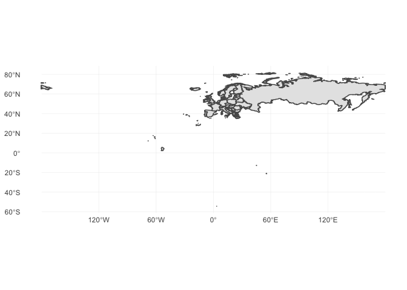
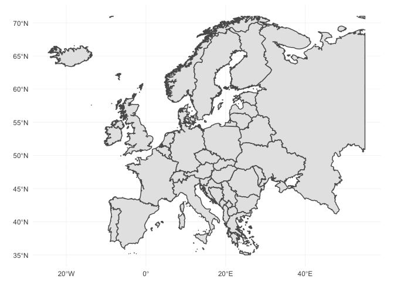
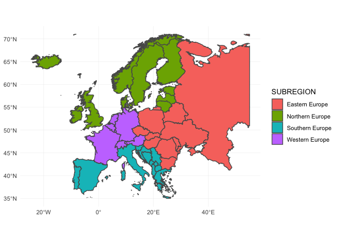
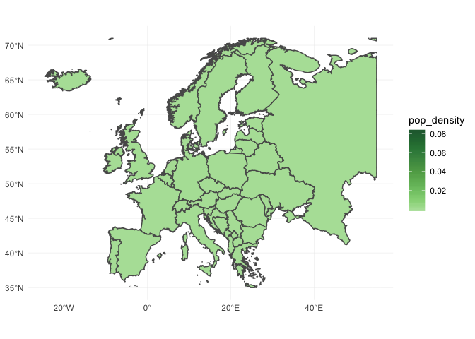
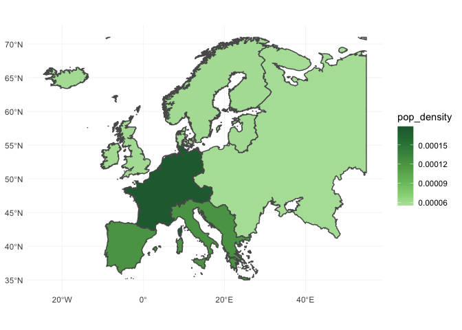
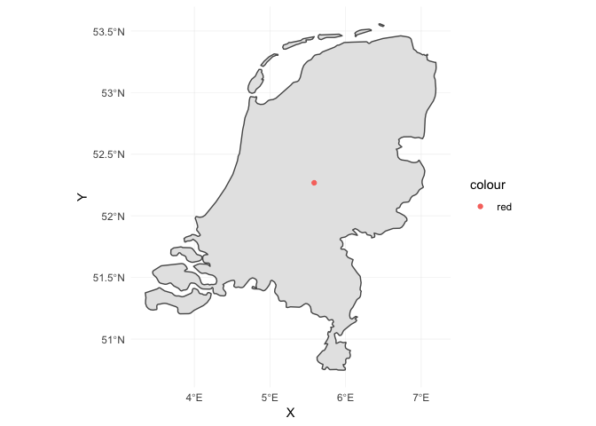

Map Plots in R in a Tidyverse Way
================
Mark van der Broek
19/09/2018

### Summary

-   I show how you can plot your own map in R using a few lines of code using a pipe-based workflow.
-   Several powerful functions of the `sf` packages are presented.

### Analysis

This week I worked on a project for which I needed to create a map plot with some statistics for selected European countries; I was unfamiliar with this kind of plots, so I searched online for possible solutions. I like the **tidyverse** workflow, so I naturally looked for any tutorials using this style. The first [hit](http://eriqande.github.io/rep-res-web/lectures/making-maps-with-R.html) was informative, but it didn't have a high resolution map for Europe. Furthermore, I like to be able to use any custom map, so I searched for ways to import a custom map.

[naturalearthdata.com](https://www.naturalearthdata.com) provides many open-source maps. I decided to select the world map with country borders on a 1:10m scale (can be found [here](https://www.naturalearthdata.com/http//www.naturalearthdata.com/download/10m/cultural/ne_10m_admin_0_countries.zip)).

``` r
library(sf)       # For handling geospatial data
library(ggplot2)  # Plotting library
library(dplyr)    # Data manipulation in tidyverse way
library(ggthemes) # Additional themese for the ggplot2 library
library(knitr)    # Nice tables for this document

# This will create a natural-earth subfolder with the map data in the data folder.
if (!file.exists("data/natural-earth")) {
  tmp_file <- tempfile(fileext=".zip")
  download.file("https://www.naturalearthdata.com/http//www.naturalearthdata.com/download/10m/cultural/ne_10m_admin_0_countries.zip", 
                tmp_file)
  unzip(tmp_file, exdir = "data/natural-earth")
}
```

Importing these maps, however, was not straightforward to me. [These lecture slides](https://cran.r-project.org/doc/contrib/intro-spatial-rl.pdf) provides a way to import custom maps, but the syntax of the `sp` package seems very untuitive with `S4` objects for the polygons. Furthermore, the `SpatialDataFrame` objects do not support a pipe-based workflow. However, [this tutorial](https://edzer.github.io/UseR2017/) presents how the modern `sf` package can be used to manipulate, plot and import spatial data in a tidyverse manner.

Importing our world map is as easy as

``` r
map_data <- st_read("data/natural-earth/", "ne_10m_admin_0_countries")
```

    ## Reading layer `ne_10m_admin_0_countries' from data source `/Users/markvanderbroek/Documents/Side Projects/Map-Plotting/data/natural-earth' using driver `ESRI Shapefile'
    ## Simple feature collection with 255 features and 94 fields
    ## geometry type:  MULTIPOLYGON
    ## dimension:      XY
    ## bbox:           xmin: -180 ymin: -90 xmax: 180 ymax: 83.6341
    ## epsg (SRID):    4326
    ## proj4string:    +proj=longlat +datum=WGS84 +no_defs

The `map_data` uses `data.frame`s for its features and saves the geometric features as a list in the column `geometry`. We can now easily explore the data in `map_data`, e.g.,

``` r
features_map_data <- map_data %>%
  as_tibble() %>%
  select(-geometry) %>%
  head(10)

kable(features_map_data)
```

| featurecla      |  scalerank|  LABELRANK| SOVEREIGNT     | SOV\_A3 |  ADM0\_DIF|  LEVEL| TYPE              | ADMIN                        | ADM0\_A3 |  GEOU\_DIF| GEOUNIT                      | GU\_A3 |  SU\_DIF| SUBUNIT                      | SU\_A3 |  BRK\_DIFF| NAME      | NAME\_LONG | BRK\_A3 | BRK\_NAME | BRK\_GROUP | ABBREV  | POSTAL | FORMAL\_EN                     | FORMAL\_FR | NAME\_CIAWF | NOTE\_ADM0 | NOTE\_BRK | NAME\_SORT                   | NAME\_ALT |  MAPCOLOR7|  MAPCOLOR8|  MAPCOLOR9|  MAPCOLOR13|    POP\_EST|  POP\_RANK|  GDP\_MD\_EST|  POP\_YEAR|  LASTCENSUS|  GDP\_YEAR| ECONOMY                    | INCOME\_GRP             |  WIKIPEDIA| FIPS\_10\_ | ISO\_A2 | ISO\_A3 | ISO\_A3\_EH | ISO\_N3 | UN\_A3 | WB\_A2 | WB\_A3 |   WOE\_ID|  WOE\_ID\_EH| WOE\_NOTE                             | ADM0\_A3\_IS | ADM0\_A3\_US |  ADM0\_A3\_UN|  ADM0\_A3\_WB| CONTINENT     | REGION\_UN | SUBREGION          | REGION\_WB                |  NAME\_LEN|  LONG\_LEN|  ABBREV\_LEN|  TINY|  HOMEPART|  MIN\_ZOOM|  MIN\_LABEL|  MAX\_LABEL|      NE\_ID| WIKIDATAID | NAME\_AR              | NAME\_BN               | NAME\_DE            | NAME\_EN                   | NAME\_ES                | NAME\_FR                      | NAME\_EL                   | NAME\_HI           | NAME\_HU | NAME\_ID                | NAME\_IT      | NAME\_JA       | NAME\_KO       | NAME\_NL             | NAME\_PL                 | NAME\_PT | NAME\_RU                      | NAME\_SV  | NAME\_TR             | NAME\_VI                    | NAME\_ZH       |
|:----------------|----------:|----------:|:---------------|:--------|----------:|------:|:------------------|:-----------------------------|:---------|----------:|:-----------------------------|:-------|--------:|:-----------------------------|:-------|----------:|:----------|:-----------|:--------|:----------|:-----------|:--------|:-------|:-------------------------------|:-----------|:------------|:-----------|:----------|:-----------------------------|:----------|----------:|----------:|----------:|-----------:|-----------:|----------:|-------------:|----------:|-----------:|----------:|:---------------------------|:------------------------|----------:|:-----------|:--------|:--------|:------------|:--------|:-------|:-------|:-------|---------:|------------:|:--------------------------------------|:-------------|:-------------|-------------:|-------------:|:--------------|:-----------|:-------------------|:--------------------------|----------:|----------:|------------:|-----:|---------:|----------:|-----------:|-----------:|-----------:|:-----------|:----------------------|:-----------------------|:--------------------|:---------------------------|:------------------------|:------------------------------|:---------------------------|:-------------------|:---------|:------------------------|:--------------|:---------------|:---------------|:---------------------|:-------------------------|:---------|:------------------------------|:----------|:---------------------|:----------------------------|:---------------|
| Admin-0 country |          5|          2| Indonesia      | IDN     |          0|      2| Sovereign country | Indonesia                    | IDN      |          0| Indonesia                    | IDN    |        0| Indonesia                    | IDN    |          0| Indonesia | Indonesia  | IDN     | Indonesia | NA         | Indo.   | INDO   | Republic of Indonesia          | NA         | Indonesia   | NA         | NA        | Indonesia                    | NA        |          6|          6|          6|          11|   260580739|         17|       3028000|       2017|        2010|       2016| 4. Emerging region: MIKT   | 4. Lower middle income  |        -99| ID         | ID      | IDN     | IDN         | 360     | 360    | ID     | IDN    |  23424846|     23424846| Exact WOE match as country            | IDN          | IDN          |           -99|           -99| Asia          | Asia       | South-Eastern Asia | East Asia & Pacific       |          9|          9|            5|   -99|         1|          0|         1.7|         6.7|  1159320845| Q252       | إندونيسيا             | ইন্দোনেশিয়া           | Indonesien          | Indonesia                  | Indonesia               | Indonésie                     | Ινδονησία                  | इंडोनेशिया         | Indonézi | a Indonesia             | Indonesia     | インドネシア   | 인도네시아     | Indonesië            | Indonezja                | Indonési | a Индонезия                   | Indonesie | n Endonezya          | Indonesia                   | 印度尼西亚     |
| Admin-0 country |          5|          3| Malaysia       | MYS     |          0|      2| Sovereign country | Malaysia                     | MYS      |          0| Malaysia                     | MYS    |        0| Malaysia                     | MYS    |          0| Malaysia  | Malaysia   | MYS     | Malaysia  | NA         | Malay.  | MY     | Malaysia                       | NA         | Malaysia    | NA         | NA        | Malaysia                     | NA        |          2|          4|          3|           6|    31381992|         15|        863000|       2017|        2010|       2016| 6. Developing region       | 3. Upper middle income  |        -99| MY         | MY      | MYS     | MYS         | 458     | 458    | MY     | MYS    |  23424901|     23424901| Exact WOE match as country            | MYS          | MYS          |           -99|           -99| Asia          | Asia       | South-Eastern Asia | East Asia & Pacific       |          8|          8|            6|   -99|         1|          0|         3.0|         8.0|  1159321083| Q833       | ماليزيا               | মালয়েশিয়া            | Malaysia            | Malaysia                   | Malasia                 | Malaisie                      | Μαλαισία                   | मलेशिया            | Malajzia | Malaysia                | Malesia       | マレーシア     | 말레이시아     | Maleisië             | Malezja                  | Malásia  | Малайзия                      | Malaysia  | Malezya              | Malaysia                    | 马来西亚       |
| Admin-0 country |          6|          2| Chile          | CHL     |          0|      2| Sovereign country | Chile                        | CHL      |          0| Chile                        | CHL    |        0| Chile                        | CHL    |          0| Chile     | Chile      | CHL     | Chile     | NA         | Chile   | CL     | Republic of Chile              | NA         | Chile       | NA         | NA        | Chile                        | NA        |          5|          1|          5|           9|    17789267|         14|        436100|       2017|        2002|       2016| 5. Emerging region: G20    | 3. Upper middle income  |        -99| CI         | CL      | CHL     | CHL         | 152     | 152    | CL     | CHL    |  23424782|     23424782| Exact WOE match as country            | CHL          | CHL          |           -99|           -99| South America | Americas   | South America      | Latin America & Caribbean |          5|          5|            5|   -99|         1|          0|         1.7|         6.7|  1159320493| Q298       | تشيلي                 | চিলি                   | Chile               | Chile                      | Chile                   | Chili                         | Χιλή                       | चिली               | Chile    | Chili                   | Cile          | チリ           | 칠레           | Chili                | Chile                    | Chile    | Чили                          | Chile     | Şili                 | Chile                       | 智利           |
| Admin-0 country |          0|          3| Bolivia        | BOL     |          0|      2| Sovereign country | Bolivia                      | BOL      |          0| Bolivia                      | BOL    |        0| Bolivia                      | BOL    |          0| Bolivia   | Bolivia    | BOL     | Bolivia   | NA         | Bolivia | BO     | Plurinational State of Bolivia | NA         | Bolivia     | NA         | NA        | Bolivia                      | NA        |          1|          5|          2|           3|    11138234|         14|         78350|       2017|        2001|       2016| 5. Emerging region: G20    | 4. Lower middle income  |        -99| BL         | BO      | BOL     | BOL         | 068     | 068    | BO     | BOL    |  23424762|     23424762| Exact WOE match as country            | BOL          | BOL          |           -99|           -99| South America | Americas   | South America      | Latin America & Caribbean |          7|          7|            7|   -99|         1|          0|         3.0|         7.5|  1159320439| Q750       | بوليفيا               | বলিভিয়া               | Bolivien            | Bolivia                    | Bolivia                 | Bolivie                       | Βολιβία                    | बोलिविया           | Bolívia  | Bolivia                 | Bolivia       | ボリビア       | 볼리비아       | Bolivia              | Boliwia                  | Bolívia  | Боливия                       | Bolivia   | Bolivya              | Bolivia                     | 玻利維亞       |
| Admin-0 country |          0|          2| Peru           | PER     |          0|      2| Sovereign country | Peru                         | PER      |          0| Peru                         | PER    |        0| Peru                         | PER    |          0| Peru      | Peru       | PER     | Peru      | NA         | Peru    | PE     | Republic of Peru               | NA         | Peru        | NA         | NA        | Peru                         | NA        |          4|          4|          4|          11|    31036656|         15|        410400|       2017|        2007|       2016| 5. Emerging region: G20    | 3. Upper middle income  |        -99| PE         | PE      | PER     | PER         | 604     | 604    | PE     | PER    |  23424919|     23424919| Exact WOE match as country            | PER          | PER          |           -99|           -99| South America | Americas   | South America      | Latin America & Caribbean |          4|          4|            4|   -99|         1|          0|         2.0|         7.0|  1159321163| Q419       | بيرو                  | পেরু                   | Peru                | Peru                       | Perú                    | Pérou                         | Περού                      | पेरू               | Peru     | Peru                    | Perù          | ペルー         | 페루           | Peru                 | Peru                     | Peru     | Перу                          | Peru      | Peru                 | Peru                        | 秘鲁           |
| Admin-0 country |          0|          2| Argentina      | ARG     |          0|      2| Sovereign country | Argentina                    | ARG      |          0| Argentina                    | ARG    |        0| Argentina                    | ARG    |          0| Argentina | Argentina  | ARG     | Argentina | NA         | Arg.    | AR     | Argentine Republic             | NA         | Argentina   | NA         | NA        | Argentina                    | NA        |          3|          1|          3|          13|    44293293|         15|        879400|       2017|        2010|       2016| 5. Emerging region: G20    | 3. Upper middle income  |        -99| AR         | AR      | ARG     | ARG         | 032     | 032    | AR     | ARG    |  23424747|     23424747| Exact WOE match as country            | ARG          | ARG          |           -99|           -99| South America | Americas   | South America      | Latin America & Caribbean |          9|          9|            4|   -99|         1|          0|         2.0|         7.0|  1159320331| Q414       | الأرجنتين             | আর্জেন্টিনা            | Argentinien         | Argentina                  | Argentina               | Argentine                     | Αργεντινή                  | अर्जेण्टीना        | Argentí  | na Argentina            | Argentina     | アルゼンチン   | 아르헨티나     | Argentinië           | Argentyna                | Argenti  | na Аргентина                  | Argentin  | a Arjantin           | Argentina                   | 阿根廷         |
| Admin-0 country |          3|          3| United Kingdom | GB1     |          1|      2| Dependency        | Dhekelia Sovereign Base Area | ESB      |          0| Dhekelia Sovereign Base Area | ESB    |        0| Dhekelia Sovereign Base Area | ESB    |          0| Dhekelia  | Dhekelia   | ESB     | Dhekelia  | NA         | Dhek.   | DH     | NA                             | NA         | NA          | U.K. Base  | NA        | Dhekelia Sovereign Base Area | NA        |          6|          6|          6|           3|        7850|          5|           314|       2013|         -99|       2013| 2. Developed region: nonG7 | 2. High income: nonOECD |        -99| -99        | -99     | -99     | -99         | -99     | -099   | -99    | -99    |       -99|          -99| No WOE equivalent.                    | GBR          | ESB          |           -99|           -99| Asia          | Asia       | Western Asia       | Europe & Central Asia     |          8|          8|            5|     3|       -99|          0|         6.5|        11.0|  1159320709| Q9206745   | ديكيليا كانتونمنت     | দেখেলিয়া ক্যান্টনমেন্ | ট Dekelia           | Dhekelia Cantonment        | Dekelia                 | Dhekelia                      | Ντεκέλια Κάντονμεντ        | ढेकेलिया छावनी     | Dekéli   | a Dhekelia Cantonment   | Base di Dheke | lia デケリア   | 데켈리아 지    | 역 Dhekelia Cantonme | nt Dhekelia              | Dekeli   | a Декелия                     | Dhekeli   | a Dhekelia Kantonu   | Căn cứ quân sự Dhekelia     | NA             |
| Admin-0 country |          6|          5| Cyprus         | CYP     |          0|      2| Sovereign country | Cyprus                       | CYP      |          0| Cyprus                       | CYP    |        0| Cyprus                       | CYP    |          0| Cyprus    | Cyprus     | CYP     | Cyprus    | NA         | Cyp.    | CY     | Republic of Cyprus             | NA         | Cyprus      | NA         | NA        | Cyprus                       | NA        |          1|          2|          3|           7|     1221549|         12|         29260|       2017|        2001|       2016| 6. Developing region       | 2. High income: nonOECD |        -99| CY         | CY      | CYP     | CYP         | 196     | 196    | CY     | CYP    |       -90|     23424994| WOE lists as subunit of united Cyprus | CYP          | CYP          |           -99|           -99| Asia          | Asia       | Western Asia       | Europe & Central Asia     |          6|          6|            4|   -99|         1|          0|         4.5|         9.5|  1159320533| Q229       | قبرص                  | সাইপ্রাস               | Republik Zypern     | Cyprus                     | Chipre                  | Chypre                        | Κύπρος                     | साइप्रस            | Ciprus   | Siprus                  | Cipro         | キプロス       | 키프로스       | Cyprus               | Cypr                     | Chipre   | Кипр                          | Cypern    | Kıbrıs Cumhuriyeti   | Cộng hòa Síp                | 賽普勒斯       |
| Admin-0 country |          0|          2| India          | IND     |          0|      2| Sovereign country | India                        | IND      |          0| India                        | IND    |        0| India                        | IND    |          0| India     | India      | IND     | India     | NA         | India   | IND    | Republic of India              | NA         | India       | NA         | NA        | India                        | NA        |          1|          3|          2|           2|  1281935911|         18|       8721000|       2017|        2011|       2016| 3. Emerging region: BRIC   | 4. Lower middle income  |        -99| IN         | IN      | IND     | IND         | 356     | 356    | IN     | IND    |  23424848|     23424848| Exact WOE match as country            | IND          | IND          |           -99|           -99| Asia          | Asia       | Southern Asia      | South Asia                |          5|          5|            5|   -99|         1|          0|         1.7|         6.7|  1159320847| Q668       | الهند                 | ভারত                   | Indien              | India                      | India                   | Inde                          | Ινδία                      | भारत               | India    | India                   | India         | インド         | 인도           | India                | Indie                    | Índia    | Индия                         | Indien    | Hindistan            | Ấn Độ                       | 印度           |
| Admin-0 country |          0|          2| China          | CH1     |          1|      2| Country           | China                        | CHN      |          0| China                        | CHN    |        0| China                        | CHN    |          0| China     | China      | CHN     | China     | NA         | China   | CN     | People's Republic of China     | NA         | China       | NA         | NA        | China                        | NA        |          4|          4|          4|           3|  1379302771|         18|      21140000|       2017|        2010|       2016| 3. Emerging region: BRIC   | 3. Upper middle income  |        -99| CH         | CN      | CHN     | CHN         | 156     | 156    | CN     | CHN    |  23424781|     23424781| Exact WOE match as country            | CHN          | CHN          |           -99|           -99| Asia          | Asia       | Eastern Asia       | East Asia & Pacific       |          5|          5|            5|   -99|         1|          0|         1.7|         5.7|  1159320471| Q148       | جمهورية الصين الشعبية | গণপ্রজাতন্ত্রী চীন     | Volksrepublik China | People's Republic of China | República Popular China | République populaire de Chine | Λαϊκή Δημοκρατία της Κίνας | चीनी जनवादी गणराज् | य Kína   | Republik Rakyat Tiongko | k Cina        | 中華人民共和国 | 중화인민공화국 | Volksrepubliek China | Chińska Republika Ludowa | China    | Китайская Народная Республика | Kina      | Çin Halk Cumhuriyeti | Cộng hòa Nhân dân Trung Hoa | 中华人民共和国 |

For this tutorial we want to focus on a European countries, hence we need to filter the data to only contain the european countries' info. Fortunately, the `map_data` contains a feature `CONTINTENT`, so we can easily filter out the unwanted countries.

``` r
europe_map_data <- map_data %>%
  select(NAME, CONTINENT, SUBREGION, POP_EST) %>%
  filter(CONTINENT == "Europe") 
```

Lets try to plot a map of European countries. New versions of `ggplot2` contain a function `geom_sf` which supports plotting `sf` objects directly, so lets try it...

``` r
ggplot(europe_map_data) + geom_sf() +
  theme_minimal()
```



That does not seem to work... the reason is that, even though we removed the data of non European countries, we never changed the `bbox` setting of our data. The `bbox` object sets the longitude and latitude range for our plot, which is still for the whole europe. To change this we can use the `st_crop` function as

``` r
europe_map_data <- europe_map_data %>%
  st_crop(xmin=-25, xmax=55, ymin=35, ymax=71)
```

    ## although coordinates are longitude/latitude, st_intersection assumes that they are planar

    ## Warning: attribute variables are assumed to be spatially constant
    ## throughout all geometries

``` r
ggplot(europe_map_data) + geom_sf() +
  theme_minimal()
```



If you're familiar with the `ggplot2` workflow, it is now easy to construct the aesthetic mappings like you're used to. Our `map_data` contains a feature `SUBREGION` and Europe is divided into Northern, Eastern, Southern and Western Europe. We can easily visualise this in our European map as

``` r
ggplot(europe_map_data) + geom_sf(aes(fill=SUBREGION)) +
  theme_minimal()
```



The `sf` has many in-built functions; one of these functions is `st_area` which can be used to compute the area of polygons. The population density of each country can be easily plotted by

``` r
europe_map_data <- europe_map_data %>%
  mutate(area = as.numeric(st_area(.))) %>%
  mutate(pop_density = POP_EST / area)

ggplot(europe_map_data) + geom_sf(aes(fill=pop_density)) +
  theme_minimal() + 
  scale_fill_continuous_tableau(palette = "Green")
```



Using aggregating functions of the `tidyverse` package is also straight-forward. Lets create a similar population density plot but instead for each subregion of Europe.

``` r
subregion_data <- europe_map_data %>%
  group_by(SUBREGION) %>%
  summarise(area = sum(area), 
            pop_est = sum(POP_EST)) %>%
  ungroup() %>%
  mutate(pop_density = pop_est / area)

ggplot(subregion_data) + geom_sf(aes(fill=pop_density)) +
  theme_minimal() + 
  scale_fill_continuous_tableau(palette = "Green")
```



As a last exercise lets find the centroid for each country.

``` r
# First get all centroids of each European country
get_coordinates = function(data) {
  return_data <- data %>%
    st_geometry() %>%
    st_centroid() %>%
    st_coordinates() %>%
    as_data_frame()
}

europe_centres <- europe_map_data %>%
  group_by(NAME) %>%
  do(get_coordinates(.))

europe_map_data <- europe_map_data %>%
  left_join(europe_centres, by="NAME")
```

Actually, I only want to see the centroid of the Netherlands...

``` r
netherlands_map_data = europe_map_data %>%
  filter(NAME == "Netherlands") %>%
  st_crop(xmin=1, xmax=10, ymin=50, ymax=55)
```

    ## although coordinates are longitude/latitude, st_intersection assumes that they are planar

    ## Warning: attribute variables are assumed to be spatially constant
    ## throughout all geometries

``` r
ggplot(netherlands_map_data) + geom_sf() +
  geom_point(aes(x=X, y=Y, colour="red")) + 
  theme_minimal()
```



### Setup

The analysis of this tutorial is performed using R version 3.5.1. To use the `st_crop` function from the `sf` package version 0.6.3 is needed. `geom_sf` also requires a recent version of `ggplot2`.
